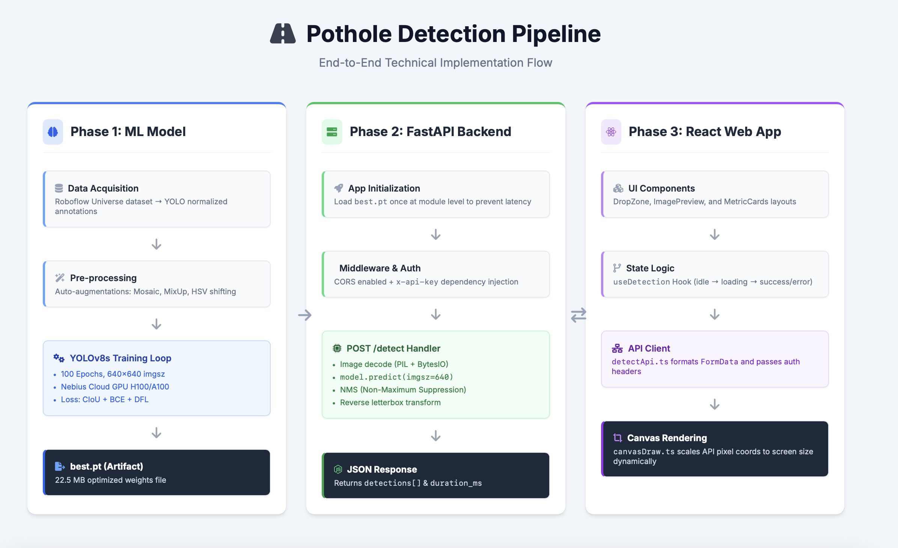
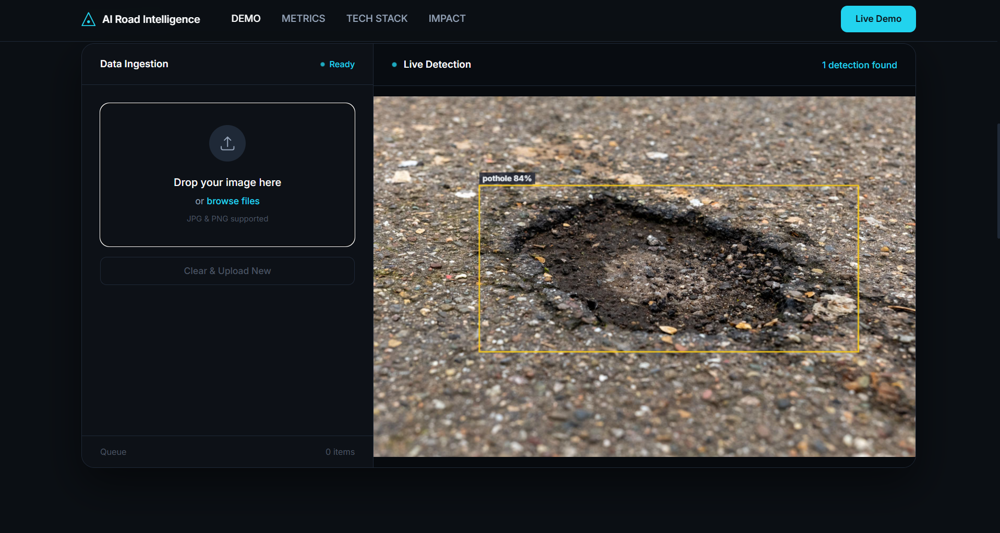
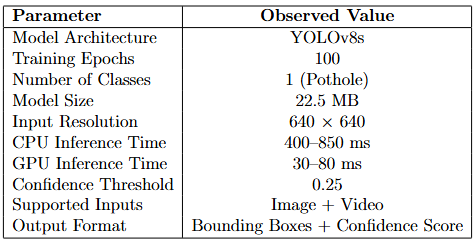

# RoadGuard AI — Intelligent Pothole Detection & Road Surface Monitoring

An end-to-end computer vision system for **real-time pothole detection** from road images and videos using **YOLOv8, FastAPI, React, and OpenCV**.

The system automatically detects potholes, localizes them with bounding boxes, processes both images and videos, and provides an interactive web dashboard for visualization, inference monitoring, and performance analysis.

---

# Demo

## System Architecture



## Application Demo



## Performance Analysis



---

# Features

* Real-time pothole detection
* Image upload and inference
* Video upload and frame-by-frame detection
* Browser-compatible H264 video export
* Secure REST API with API-key authentication
* Bounding box visualization
* Detection confidence scores
* Inference performance metrics
* CPU and GPU support
* Modular full-stack architecture

---

# Problem Statement

Traditional road inspection methods are:

* Time consuming
* Expensive
* Difficult to scale
* Human dependent
* Subjective

RoadGuard AI automates pothole detection using computer vision and deep learning for:

* Smart city monitoring
* Municipal maintenance planning
* Fleet-based road inspection
* Autonomous vehicle perception
* Infrastructure analytics

---

# Tech Stack

## Machine Learning

* Python
* PyTorch
* YOLOv8
* Ultralytics
* OpenCV
* Pillow

## Backend

* FastAPI
* Uvicorn

## Frontend

* React
* TypeScript
* Vite
* HTML5 Canvas

## Video Processing

* OpenCV
* FFmpeg
* imageio-ffmpeg

---

# System Architecture

```text
User Upload
    ↓
React Frontend
    ↓
FastAPI Backend
    ↓
API Authentication
    ↓
Image / Video Decoding
    ↓
YOLOv8 Inference
    ↓
Non-Maximum Suppression
    ↓
JSON / Video Response
    ↓
Bounding Box Visualization
```

---

# Project Structure

```bash
roadguard-ai/
│
├── docs/
├── images/
├── models/
├── training/
├── inference/
├── web/
├── app/
│
├── requirements.txt
├── dockerfile
├── README.md
└── LICENSE
```

---

# Model Training

YOLOv8 was fine-tuned using transfer learning on a custom pothole detection dataset.

Training configuration:

* Model: YOLOv8s
* Classes: 1
* Epochs: 100
* Image Size: 640
* Batch Size: 8

Training command:

```bash
yolo detect train \
model=yolov8s.pt \
data=training/data.yaml \
epochs=100 \
imgsz=640 \
batch=8
```

---

# Inference Pipeline

## Image Detection

```text
Upload image
↓
FastAPI receives file
↓
Authentication
↓
Image decoding
↓
YOLOv8 inference
↓
NMS filtering
↓
JSON response
↓
Frontend visualization
```

## Video Detection

```text
Upload video
↓
Frame extraction
↓
Frame-by-frame detection
↓
Bounding box annotation
↓
AVI generation
↓
FFmpeg H264 encoding
↓
Browser-compatible MP4
```

---

# Installation

## Clone Repository

```bash
git clone https://github.com/ronakparmar11/roadguard-ai.git
cd roadguard-ai
```

## Install Backend Dependencies

```bash
pip install -r requirements.txt
```

## Install Frontend Dependencies

```bash
cd web
npm install
```

---

# Environment Variables

Create `.env`

```env
API_KEY=roadguard_dev_key
MODEL_PATH=models/best.pt
```

---

# Run Backend

```bash
uvicorn inference.server:app --reload --port 8001
```

Backend:

```text
http://127.0.0.1:8001
```

Swagger API Docs:

```text
http://127.0.0.1:8001/docs
```

---

# Run Frontend

```bash
cd web
npm run dev
```

Frontend:

```text
http://localhost:5173
```

---

# API Endpoints

Health Check:

```http
GET /health
```

Image Detection:

```http
POST /detect
```

Video Detection:

```http
POST /detect-video
```

---

# Sample API Response

```json
{
  "detections": [
    {
      "label": "pothole",
      "confidence": 0.91,
      "box": [412, 220, 650, 390]
    }
  ],
  "duration_ms": 472
}
```

---

# Performance

* Model Size: 22.5 MB
* Parameters: ~11 Million
* CPU Inference: 400–850 ms
* GPU Inference: 30–80 ms
* Confidence Threshold: 0.25

---

# Computer Vision Concepts Used

* Transfer Learning
* Object Detection
* Bounding Boxes
* Non-Maximum Suppression (NMS)
* Confidence Thresholding
* Multi-scale Feature Extraction
* Video Frame Processing
* H264 Encoding

---

# Future Improvements

* Severity classification
* Crack detection
* GPS mapping
* Real-time webcam support
* Edge deployment
* Mobile application

---

# Author

**Ronak Parmar**

Computer Vision | Machine Learning | Full Stack Development

---

# License

This project is licensed under the MIT License.
